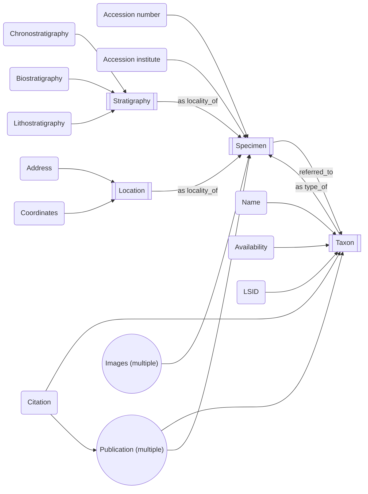
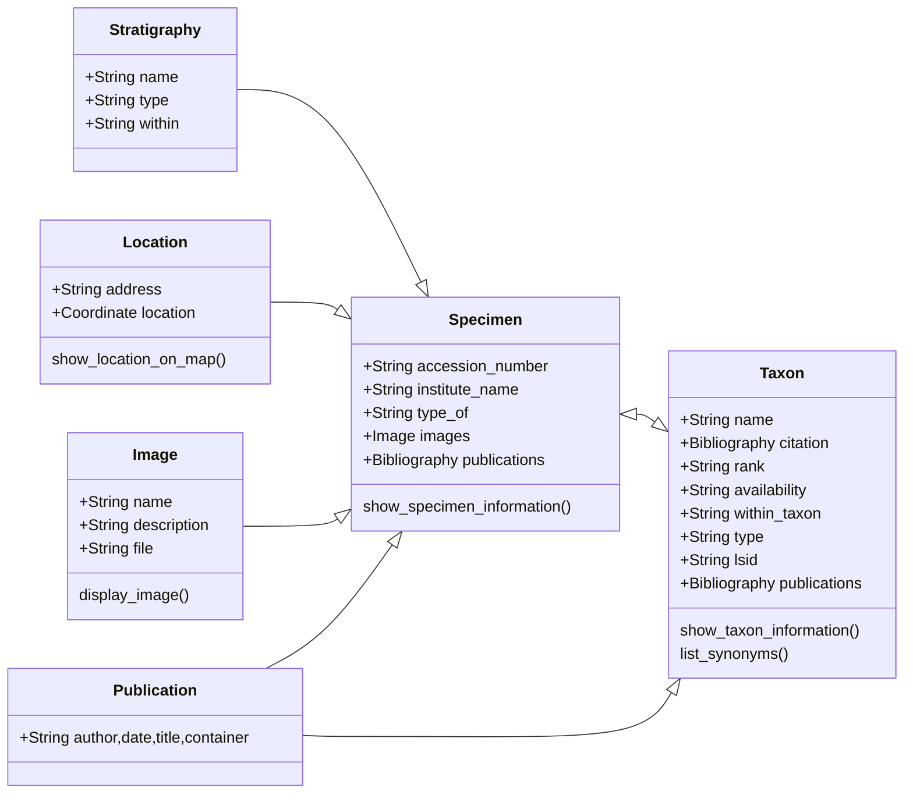

# Aim #

Retrieve and view occurrence records for a taxon based on name or age.

## Taxon names ##

1. A taxon has a name; this can be a genus, species, or a higher taxon.
2. For each name there will be some number of occurrences that are assigned to it.
3. Some names are considered valid or *available*.
4. Some names have been *synonymized* into the valid names, so aren't available.
5. Some names are *uncertain*, and may be available.

## Occurrences ##

1. Occurrences are individual records of specific taxa.
2. Occurrences are found in a specific horizon (= time) at a specific location (= place).
    a. Occurrences can be individual specimens.
    b. Occurrences can be groups of specimens assigned to a single taxon from a single (or constrained) horizon and location.

# Data Form #

## Taxon names ##

A full taxon name is made up of two groups:

1. The taxon/clade/genus/species name
    a. Most commonly one or two parts, but may be several if using subgenus and subspecies names.
    b. Examples
        i. clade: Ichthyosauria
        ii. family: Ichthyosauridae
        iii. genus: *Ichthyosaurus*
        iv.  species: *Ichthyosaurus communis*
2. Original publication citation
    a. Typically the author(s) name(s) and year of publication.
    b. There is not specific style, but the ICZN uses 'Author, Year'.
    c. Modified names (e.g. through reassignment) are indicated in parentheses, '(Author, Year)'.
    d. Examples
        i. Ichthyosauria de Blainville, 1835
        ii. *Ichthyosaurus communis* Conybeare, 1822
        iii. *Ophthalmosaurus natans* (Marsh, 1879)

All taxon names will have the following information:

1. Name
    a. The taxon name.
    b. Also specify the name rank.
2. Original name citation
    a. The publication that made the name available.
    b. Modification will be shown in parentheses.
3. Status
    a. The availability status of the name.
4. Type specimen(s)
    a. Typically a *holotype*.
    b. Some taxa may have a *lectotype*, *paratypes*, or other forms of type specimen.
5. Type locality
    1. A type horizon and location associated with the type specimen.
    2. Inherited from type specimen.
6. Assigned material
    a. Specimens assigned to this taxon.
    b. Specimens may be directly assigned or inherited from a synonym.

Taxon names may also have the following records:

1. LSID
    a. An identifier assigned through ZooBank (or similar).
2. Additional references
    a. One or more mentions of the taxon name that may or may not reference specific specimens.

Unavailable names will also have:

1. Available name
    a. The available to which this name is now referred.
2. Citation of unavailability
    a. The publication that determined that this name is unavailable.

## Occurrences and specimens ##

Working at the level of specimens provides finer granularity, and the possibility to attach individual images and publications as these appear, but will lead to relative duplication as multiple specimens from the same locality are assigned to the same taxon. Unless these specimens occur on the exact same bedding plane, there is an argument to consider them as non-contemporaneous and so as separate occurrences.

An important question to ask is: *do names own the specimens to which they belong, or do specimens own the names?* In the implementation sense that means: should the taxon name record include the specimens referred to it, or should a specimen record include the taxon to which it's referred.

Having taxa own specimens means that records can inherit specimens originally referred to other taxa and the names originally assigned to them: creating synonymy lists should be straightforward for that. This applies to other specimen-specific records too, including localities and images. For specimen assignment changes, the modifications need only occur in one place: in the taxon name. The information works its way 'upwards' from the smallest to largest groupings.

Specimens owning the names is closer to taxonomic philosophy. A taxon name is defined based on a given *type specimen*, and that specimen retains that name, even when the accepted name is different. It does, however, make grouping specimens under accepted names more difficult: names need to be assigned to each specimen, which then gains multiple names as taxa are synonymized.

I would suggest this structure:

1. Specimens own names for which they are a type specimen.
2. Names list specimens referred to them.
    a. The names owned by specimens propagate as they are referred to taxa.

All occurrences/specimens will include the following:

1. Specimen number
    a. The accession number in its holding institute.
2. Institute name
    a. Name of the holding institute.
    b. May also include address and other information.
3. Stratigraphy
    a. The horizon in which the specimen was found.
    b. May include:
        i. Chronostratigraphy.
        ii. Lithostratigraphy.
        iii. Biostratigraphy.
4. Location
    a. The geographical location at which the specimen was found.
    b. May include:
        i. Address, town, country.
        ii. Geographical coordinates (in one of several reference systems).
5. Original taxon assignment.
    a. The taxon to which the material was originally assigned.

It may also be useful to include:

1. Accepted taxon assignment
    a. The taxon that the specimen is currently assigned to.

A specimen may also contain:

1. Images
    a. One or a series of photographs or drawings in different orientations.
2. Publications
    a. One or more publications that it has reference in.

# Data scheme #

Most information is contained within a *specimen*, acting as the repository for locality, publication, image, and accession information. A *taxon* inherits this information and applies a name, availability, and LSID, alongside taxon-specific publications. An *available taxon* is the prime view in, inheriting the specimen and locality information, but not name information. A *taxon* can contain another *taxon* of a lower rank, so will inherit the information of the lower rank (e.g. specimens, stratigraphy, location).

